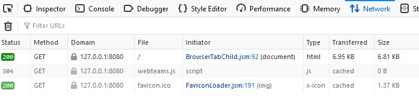
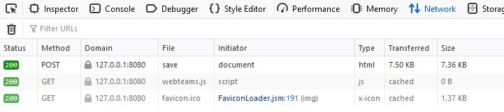
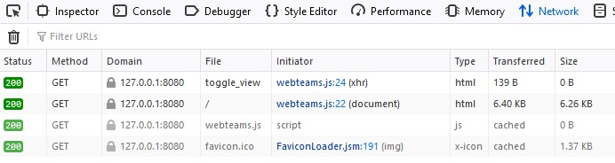

# 2. Durchgeführte Ergänzungen #

Das Formular wurde um die zweite Person erweitert und zusätzlich wurde eine Eingabe "Semesteranzahl" ergänzt, sodass das Formular statt der ursprünglichen 3 Eingabefelder nun 8 Eingabefelder hat.

Die Listenansicht wurde um die Darstellung der zweiten Person und das Attribut "Semesteranzahl" ergänzt, sodass ein Team aus jeweils 2 Zeilen und 4 Spalten besteht.

Die Aktion "abbrechen" wurde im Formular ergänzt. Ein Klick auf "abbrechen" bricht die Formular-Bearbeitung ab und führt zurück auf die Startseite.

Das Löschen von Einträgen wurde implementiert. Hierzu wurde ein Button bei jedem Team ergänzt, das beim Klick ein Dialog-Fenster öffnet mit der Nachfrage: "Wollen Sie den Eintrag wirklich löschen?" und den Optionen "OK" und "Cancel". Klickt der Benutzer auf "OK", wird der Datensatz gelöscht und die Webseite neu geladen, sodass die aktalisierte Liste angezeigt wird. Klickt der Benutzer auf "Cancel", schließt sich lediglich das Dialog-Fenster.

Die Möglichkeit zur Umschaltung zwischen einer Listenansicht und einer Aufzählungsansicht wurde geschaffen. Bei Klick auf die Schaltfläche "als Aufzählung/Liste darstellen" aktiviert sich die jeweils andere Ansicht.

Außerdem wurde die Webseite mit CSS gestylt. Unter anderem wurden die Aktionen "erfassen", "bearbeiten", "löschen", "als Aufzählung/Liste darstellen", "abbrechen" und "speichern" allesamt äußerlich einheitlich als Schaltfläche dargestellt, obwohl es sich um 3 unterschiedliche HTML-Elemente handelt (\<a>, \<button>, \<form type="submit">).

Es existiert nun auch die Möglichkeit, den Server per Aufruf der Adresse "http://127.0.0.1:8080/shutdown" herunterzufahren. Diese Option wird dem Benutzer auf der Webseite nicht angezeigt.

---

# 3. Beschreibung des HTTP-Datenverkehrs #

## 3.1. beim Start der Anwendung ##

Wird die Webseite aufgerufen, schickt der Browser eine GET-Request an den Server, in der ein html-Dokument angefordert wird. Dieses wird auch vom Server ausgeliefert, nebst CSS Stylesheet und JavaScript-Datei.

## 3.2. beim Speichern von Formulardaten ##

Klickt der Benutzer auf "speichern", sendet der Browser eine POST-Request an den Server mit allen Daten, die der Benutzer eingegeben hat und die vom Server generierte ID.

## 3.3. beim Umschalten zwischen verschiedenen Ansichten ##

